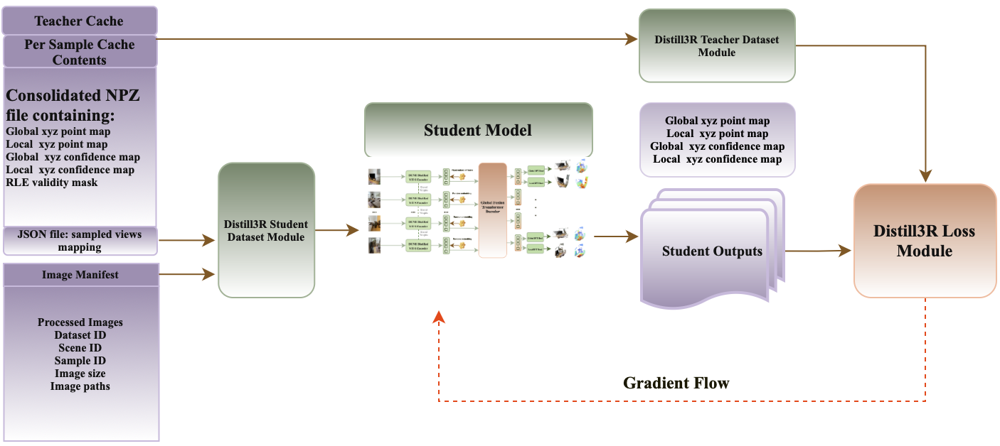
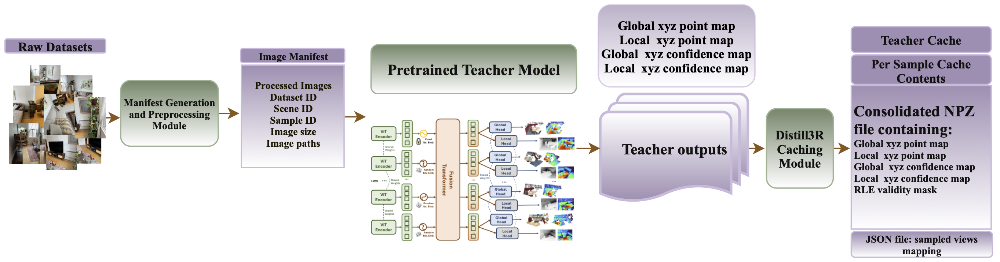

<div align="center">
<h1>Distill3R: An Exploratory Pipeline for Democratizing 3D Foundation Models on Commodity Hardware</h1>

[**Brandon Leblanc**](mailto:brandon.leblanc@mail.concordia.ca) · [**Charalambos Poullis**](https://www.theictlab.org/)

Immersive and Creative Technologies Lab, Concordia University

[[ArXiv](https://arxiv.org/abs/2602.00865)] · [[Citation](#citation)]

</div>

<!-- omit in toc -->
# Easy Navigation

- [Summary](#summary)
- [Model Overview](#model-overview)
- [Pre-trained Models](#pre-trained-models)
- [Installation](#installation)
  - [Conda Environment](#conda-environment)
  - [External Dependencies](#external-dependencies)
  - [Pre-trained Weights](#pre-trained-weights)
- [Training Pipeline](#training-pipeline)
  - [Datasets](#datasets)
  - [Manifest Generation](#manifest-generation)
  - [Teacher Cache Generation](#teacher-cache-generation)
  - [Student Training](#student-training)
- [Evaluation](#evaluation)
- [Inference](#inference)
- [Citation](#citation)
- [Acknowledgments](#acknowledgments)

# Summary

Distill3R is a knowledge distillation framework designed to compress large-scale 3D foundation models into compact students that are fully trainable on a single workstation. While models like [Fast3R](https://github.com/facebookresearch/fast3r) (650M parameters, trained on 128 A100 GPUs for 6 days) and [VGGT](https://github.com/facebookresearch/vggt) (1B parameters, trained on 64 A100 GPUs for 9 days) have achieved state-of-the-art results in multi-view 3D reconstruction, their computational requirements create a significant barrier to entry for most academic laboratories.

Distill3R bridges this compute divide through two primary innovations:

1. **Offline Teacher Caching**: A pipeline that decouples heavy teacher inference from the training loop by pre-computing and compressing supervision signals (point maps, confidence maps) into an efficient cache format.

2. **Confidence-Aware Distillation Loss**: A loss function that leverages the teacher's learned uncertainty to weight geometric supervision, preventing degenerate solutions and stabilizing training on commodity hardware.

Our 72M-parameter student achieves:
- **9x parameter reduction** compared to the 650M-parameter Fast3R teacher
- **5x inference speedup** at 128 views
- **Full training in under 3 days** on a single workstation with 2x RTX 6000 Ada GPUs

This work is not intended to compete with state-of-the-art foundation models, but to provide an accessible research baseline for laboratories without access to large-scale compute. Additionally, this pipeline enables practitioners to train and specialize the model on their own domain-specific data at minimal cost.

# Model Overview



**Architecture:**
- **Encoder**: [DUNE](https://github.com/naver/dune) ViT-Small (21M parameters) with weights shared across all N views
- **Fusion Decoder**: Compressed transformer (6 layers, 6 heads, 384 embedding dim) with cross-view self-attention
- **Prediction Heads**: Two lightweight DPT heads for global/local 3D coordinates and confidence maps

**Training Pipeline:**
1. Raw datasets are processed into a unified manifest
2. Fast3R teacher generates supervision signals (point maps + confidence) for each sample
3. Outputs are compressed (float16 + RLE encoding) and cached to disk
4. Student trains on cached supervision without requiring teacher inference

# Pre-trained Models

| Model | Parameters | Checkpoint |
|-------|------------|------------|
| Fast3R (Teacher) | 650M | [Official](https://github.com/facebookresearch/fast3r) |
| Distill3R (Ours) | 72M | [Download](https://drive.google.com/file/d/1_LKdpyBZGWN43y2VCLrWwPLxtmj2mnk-/view?usp=sharing) |

## Inference Efficiency

System efficiency comparison on RTX 6000 Ada. All methods except Fast3R evaluated at 378×518 resolution; Fast3R uses 384×512.

| Method | N=12 | | N=32 | | N=64 | | N=96 | | N=128 | |
|--------|------|------|------|------|------|------|------|------|-------|------|
| | Time (s) | Mem (GB) | Time (s) | Mem (GB) | Time (s) | Mem (GB) | Time (s) | Mem (GB) | Time (s) | Mem (GB) |
| Fast3R (Teacher) | 0.32 | 6.86 | 1.14 | 12.11 | 3.26 | 21.11 | 6.35 | 32.36 | 10.11 | 44.36 |
| VGGT | 0.59 | 15.28 | 2.28 | 33.98 | 6.40 | 38.41 | OOM | OOM | OOM | OOM |
| **Distill3R (Ours)** | **0.13** | **4.05** | **0.41** | **9.97** | **1.02** | 21.80 | **1.78** | **28.69** | **2.69** | **31.90** |


# Installation

## External Dependencies

Clone the repository with submodules:

```bash
git clone --recursive https://github.com/TheFourthKaramazov/Distill3R.git
cd Distill3R
```

The following external repositories are included as submodules:
- `external/fast3r/` - Fast3R teacher model
- `external/dune/` - DUNE encoder

## Conda Environment

Create a conda environment with all necessary packages:

```bash
conda env create -f environment.yml
conda activate distill3r
```

Or manually:

```bash
conda create -n distill3r python=3.10
conda activate distill3r
pip install torch torchvision --index-url https://download.pytorch.org/whl/cu121
pip install lightning timm einops omegaconf pynvml psutil tqdm pillow opencv-python matplotlib
```


## Pre-trained Weights

**DUNE Encoder** (required for training):
```bash
mkdir -p pretrained_models
wget -O pretrained_models/dune_vitsmall14_448.pth \
  "https://download.europe.naverlabs.com/dune/dune_vitsmall14_448.pth"
```

**Fast3R Teacher** (required for cache generation):
Automatically downloaded via `torch.hub` during cache generation.

# Training Pipeline

## Datasets

We train on six established datasets following Fast3R:

| Dataset | Type | Description |
|---------|------|-------------|
| [CO3D-v2](https://github.com/facebookresearch/co3d) | Object-centric | Real-world object videos |
| [ScanNet++](https://kaldir.vc.in.tum.de/scannetpp/) | Indoor | High-fidelity indoor scans |
| [Habitat](https://aihabitat.org/) | Indoor | Rendered indoor navigation |
| [MegaDepth](https://www.cs.cornell.edu/projects/megadepth/) | Outdoor | Internet photos with SfM depth |
| [BlendedMVS](https://github.com/YoYo000/BlendedMVS) | Mixed | Blended real/synthetic scenes |
| [ARKitScenes](https://github.com/apple/ARKitScenes) | Indoor | Mobile RGB-D captures |

> **Note:** We will shortly provide the complete subsampled training data upon request. However, the primary goal of this pipeline is to enable others to train the model on their own domain-specific data. This is what Distill3R was built for. If training on your own data, using the empty directories and config files for the above data as a guide for your own implemntation will make the process simple.

Configure dataset paths in `configs/data_paths.yaml`.

## Manifest Generation

Process raw images and create training manifest:

```bash
python utils/generate_manifest.py
```

**Configuration** (`configs/data_paths.yaml`):
- `sample_frac`: Fraction of scenes to use (default: 0.4)
- `resize_max`: Maximum image edge size (default: 960px)

**Output**:
- Processed images: `processed_data/images/{dataset}/*.png`
- Manifest CSV: `processed_data/images/manifest.csv`

## Teacher Cache Generation



Generate supervision signals from Fast3R teacher:

```bash
python distill3r/teacher/export_fast3r.py
```

**Environment Variables**:
```bash
export TEACHER_MANIFEST_PATH="processed_data/images/manifest.csv"
export TEACHER_CACHE_DIR="caches/teacher_cache"
export TEACHER_MAX_VIEWS=20
export TEACHER_MAX_SAMPLES_PER_SCENE=5
```

**Output** (per sample):
```
caches/teacher_cache/{dataset}/{scene}_sample{N}/
├── consolidated.npz    # Stacked predictions for all N views
│   ├── xyz_global      [N, 224, 518, 3] float16
│   ├── xyz_local       [N, 224, 518, 3] float16
│   ├── conf_global     [N, 224, 518] float16
│   ├── conf_local      [N, 224, 518] float16
│   └── masks           [N] RLE-encoded boolean
└── sampled_views.json  # View indices for reproducibility
```

**Resume interrupted cache generation**:
```bash
python distill3r/teacher/export_fast3r.py --resume
```

## Student Training

Train the distilled student model:

```bash
python distill3r/train.py --config configs/distill3r.yaml
```

**Key Configuration** (`configs/distill3r.yaml`):
```yaml
model:
  encoder_type: "dune"        

training:
  num_gpus: 2
  batch_size: 4                  # Per-GPU
  gradient_accumulation_steps: 2 # Effective batch size: 16
  max_epochs: 60

loss:
  alpha_global: 2.0              # Global geometry weight
  alpha_local: 1.0               # Local geometry weight
  gamma_conf: 0.001              # Confidence supervision weight
```

**Loss Function**:
```
L_total = α_g · L_global + α_l · L_local + γ · L_conf

L_global: Confidence-weighted L2 on global 3D coordinates (cross-view normalized)
L_local:  Confidence-weighted L2 on local 3D coordinates (per-view normalized)
L_conf:   L1 on confidence maps
```

**Monitor Training**:
```bash
tensorboard --logdir logs/
```

# Evaluation

Evaluation code coming soon.

# Inference

Run inference on a directory of images to generate a colored 3D point cloud:

```bash
python utils/test_checkpoint_images.py path/to/images/ \
    --checkpoint checkpoints/distill3r/last.ckpt \
    --output-dir results/
```

**Options:**
- `--size`: Image preprocessing size (default: 518)
- `--conf-percentile`: Confidence threshold percentile (default: 10, keeps top 90% most confident points)
- `--device`: Device to use (default: cuda)

**Example:**
```bash
# Run inference on sample images
python utils/test_checkpoint_images.py samples/apple/ \
    --checkpoint checkpoints/distill3r/last.ckpt \
    --output-dir results/apple_reconstruction \
    --conf-percentile 15
```

**Output:**
- `{scene_name}_student.ply`: Colored point cloud (viewable in MeshLab, CloudCompare, etc.)
- `{scene_name}_info.txt`: Inference metadata and timing

# Citation

If you find this work useful, please consider citing:

```bibtex
@article{leblanc2025distill3r,
    title={{Distill3R}: An Exploratory Pipeline for Democratizing {3D} Foundation Models on Commodity Hardware},
    author={Leblanc, Brandon and Poullis, Charalambos},
    journal={arXiv preprint arXiv:2602.00865},
    year={2025},
}
```

# Acknowledgments

This work was supported by the Natural Sciences and Engineering Research Council of Canada (NSERC) through the CGS-M scholarship.

Built on top of:
- [Fast3R](https://github.com/facebookresearch/fast3r) - Teacher model
- [DUNE](https://github.com/naver/dune) - Pre-trained encoder
- [DUSt3R](https://github.com/naver/dust3r) - Point map representation

Training datasets:
- [CO3D-v2](https://github.com/facebookresearch/co3d)
- [ScanNet++](https://kaldir.vc.in.tum.de/scannetpp/)
- [Habitat](https://aihabitat.org/)
- [MegaDepth](https://www.cs.cornell.edu/projects/megadepth/)
- [BlendedMVS](https://github.com/YoYo000/BlendedMVS)
- [ARKitScenes](https://github.com/apple/ARKitScenes)

# License

This project is licensed under the Apache License 2.0 - see the [LICENSE](LICENSE) file for details.
